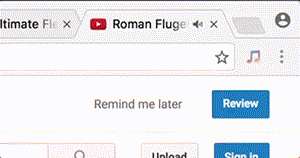

# Chromesthesia
Find out what song is playing in a Chrome tab.

Once you play something the Chromesthesia should appear.

The extension is available in chrome web store at:  
https://chrome.google.com/webstore/detail/chromesthesia/gocpionhjoififoliaelkfheedcafgin

## How does it work?
It's a Chrome extension that captures the audio playing in a tab and sends it to
audio recognition services. Currently the only supported service is
[ACRCloud](https://www.acrcloud.com]) (requires an account but there is a
free plan).

## Known issues

##### Spotify link does not work
Try to enable the "Remember my choice for all links of this type" in the
launch application dialog.

##### ACRCloud complaints that it can't generate fingerprint
Try to increse capture durtion in options. It should at least by 10 seconds.

## Help wanted
- Improve interaction and graphical design
- Write more matchers. Currently ACRCloud seems to be the only recognition
service with an open API. There is [acoustid](https://acoustid.org) but at
time of writing it can only do whole song recognition.

## Development
Clone repo and use "Load unpacked extension..." on the chrome extensions page.

To auto reload on changes you can run [devd](https://github.com/cortesi/devd) in
the repo root `devd -l .` and uncomment `reloadOnChange();` in [background.js](src/background.js).
Have a look at [dummyMatch.js.js](src/dummyMatch.js) and
[matchers.js](src/matchers.js) for how to test matcher results.

## License
Chromesthesia is licensed under the MIT license. See [LICENSE](LICENSE) for the
full license text.
