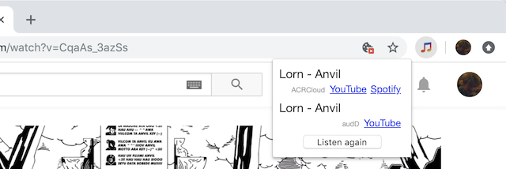

# Chromesthesia

The extension is available in Chrome web store at 
https://chrome.google.com/webstore/detail/chromesthesia/gocpionhjoififoliaelkfheedcafgin

## How does it work?

Play something and the Chromesthesia icon will appear.
Click it and it will try to recognize what is playing.

Currently these recognition services are supported:

[audD](https://audd.io) - No account required. 10 requests free per day.  
[ACRCloud](https://www.acrcloud.com) - Requires an account but there is a
free plan.  
[AudioTag](https://audiotag.info) - Requires an account but there is a
free plan.

## Thanks

Uses [shine](https://github.com/toots/shine) to do mp3 compression.

## Known issues

##### Spotify link does not work

Try to enable the "Remember my choice for all links of this type" in the
launch application dialog.

##### ACRCloud complaints that it can't generate fingerprint

Try to increase capture duration in options. It should be at least 10 seconds.

## Help wanted

- Improve interaction and graphical design
- Write more matchers

## Development

Clone repo and use "Load unpacked extension..." on the chrome extensions page.

To auto reload on changes you can run [devd](https://github.com/cortesi/devd) in
the repo root `devd -l .` and uncomment `reloadOnChange();` in [background.js](src/background.js).
Have a look at [dummyMatch.js.js](src/dummyMatch.js) and
[matchers.js](src/matchers.js) for how to test matcher results.

## Privacy

The extension itself does not track usage or collect any personal information. But the services
used to do music recognition might track of collect infomration. Please see the privacy
policies for audD, ACRCloud and AudioTag for more infomration.

## License

Chromesthesia is licensed under the MIT license. See [LICENSE](LICENSE) for the
full license text.
